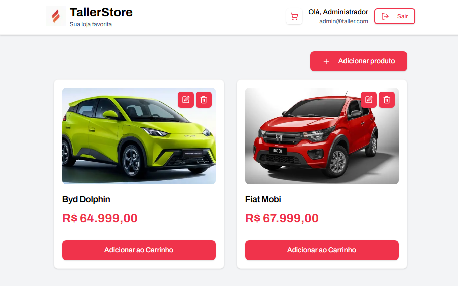

# 🛒 Frontend Carrinho com Estoque Reativo - Desafio Taller

Este projeto implementa o frontend do **Desafio 1 – Carrinho com Estoque Reativo** do processo seletivo da Taller, uma aplicação web moderna para consumir a API REST de gerenciamento de produtos e carrinhos de compra.

## 📋 Sobre o Projeto

O frontend oferece uma interface completa para:
- Autenticação de usuários (Login/Cadastro)
- Catálogo de produtos com visualização responsiva
- Gestão de carrinho de compras em tempo real
- Controle de estoque integrado com a API
- Interface administrativa para CRUD de produtos
- Sistema de finalização de pedidos

## 🏗️ Arquitetura da Aplicação

A aplicação foi estruturada seguindo os princípios de arquitetura modular e clean code:

### Decisões Arquiteturais

**Framework e Tecnologias:**
- **Next.js 15**
- **TypeScript**
- **Tailwind CSS**
- **Zustand**
- **React Hook Form + Zod**
- **Axios**
- **React Toastify**

**Estrutura Modular:**
```
src/
├── app/                    # App Router do Next.js
│   ├── (private)/          # Rotas protegidas
│   │   ├── products/       # Página de produtos
│   │   └── cart/           # Página do carrinho
│   └── (public)/           # Rotas públicas
│       └── auth/           # Login e cadastro
├── modules/                # Módulos de domínio
│   ├── auth/               # Autenticação e store
│   ├── products/           # Gestão de produtos
│   ├── cart/               # Gestão do carrinho
│   └── order/              # Finalização de pedidos
└── shared/                 # Recursos compartilhados
    ├── components/         # Componentes reutilizáveis
    ├── contexts/           # Context API
    ├── hooks/              # Custom hooks
    ├── http/               # Configuração do Axios
    └── lib/                # Utilitários
```

**Sistema de Autenticação:**
- **JWT Storage:** Tokens armazenados no localStorage com persistência
- **Route Guards:** Proteção automática de rotas privadas
- **Interceptadores:** Anexo automático de tokens e redirecionamento em caso de expiração
- **State Management:** Gerenciamento de estado de autenticação com Zustand

**Controle de Estado do Carrinho:**
- **Context API:** Provedor global do estado do carrinho
- **Sincronização:** Sincronização em tempo real com a API
- **Persistência:** Estado mantido durante a navegação
- **Otimistic Updates:** Atualizações otimistas com rollback em caso de erro

## 🎨 Interface do Usuário

A aplicação oferece uma experiência moderna e responsiva:



**Componentes Principais:**
- **Header:** Navegação com contador de itens do carrinho
- **ProductCard:** Cards de produtos com ações contextuais
- **ProductModal:** Modal para CRUD de produtos (admin)
- **OrderSummary:** Modal de finalização de pedidos
- **Responsive Design:** Layout adaptativo para desktop e mobile

**Sistema de Design:**
- **Design System:** Componentes padronizados com Tailwind CSS
- **Variáveis CSS:** Cores e espaçamentos consistentes
- **Acessibilidade:** Componentes acessíveis com ARIA labels
- **Loading States:** Estados de carregamento em todas as operações

## 🚀 Como Executar o Projeto

### Pré-requisitos
- Node.js (versão 18+)
- npm
- Git
- API backend rodando (veja repositório da API)

### 1. Clone o Repositório
```bash
git clone git@github.com:DenilsonMelo/challenge-taller-front.git
cd taller-front
```

### 2. Instale as Dependências
```bash
npm install
```

### 3. Configure o Ambiente

O arquivo `.env` está incluído com a configuração padrão:
```properties
NEXT_PUBLIC_API=http://localhost:3001
```

### 4. Execute a Aplicação

```bash
npm run dev
```

A aplicação estará disponível em `http://localhost:3000`

### 5. Acesse a Aplicação

1. Acesse `http://localhost:3000` 
2. Será redirecionado para `/auth/login`
3. Cadastre um novo usuário ou faça login
4. Explore o catálogo de produtos
5. Adicione itens ao carrinho
6. Finalize pedidos

### 6. Credenciais de Teste

Para facilitar os testes, existe um usuário administrador pré-cadastrado:

**Administrador:**
```
Email: admin@taller.com
Senha: admintaller
```

**Nota:** Você também pode criar uma conta de usuário comum através da tela de cadastro.

## 🔗 API Backend

Este frontend consome a API REST desenvolvida para o mesmo desafio:

**Repositório da API:** [https://github.com/DenilsonMelo/challenge-taller-api](https://github.com/DenilsonMelo/challenge-taller-api)

**Certifique-se de que a API esteja rodando** em `http://localhost:3001` antes de iniciar o frontend.

## 🛡️ Funcionalidades de Segurança

- **Autenticação JWT:** Tokens seguros com renovação automática
- **Route Protection:** Rotas protegidas com redirecionamento automático
- **Authorization:** Diferentes permissões para ADMIN e CLIENT
- **Validation:** Validação de formulários no frontend e backend
- **Error Handling:** Tratamento robusto de erros com feedback ao usuário

## 📱 Funcionalidades Principais

### Para Usuários (CLIENT)
- ✅ Cadastro e login de conta
- ✅ Visualização do catálogo de produtos
- ✅ Adição de produtos ao carrinho
- ✅ Gestão de quantidades no carrinho
- ✅ Remoção de itens do carrinho
- ✅ Finalização de pedidos
- ✅ Verificação de estoque em tempo real

### Para Administradores (ADMIN)
- ✅ Todas as funcionalidades de usuário
- ✅ Criação de novos produtos
- ✅ Edição de produtos existentes
- ✅ Exclusão de produtos


## 📝 Considerações Finais

Esta implementação demonstra:
- **Interface moderna** com Next.js 15 e Tailwind CSS
- **Estado global robusto** com Zustand e Context API
- **Integração completa** com API REST
- **Experiência do usuário** otimizada e responsiva
- **Código maintível** com TypeScript e arquitetura modular
- **Boas práticas** de desenvolvimento frontend moderno